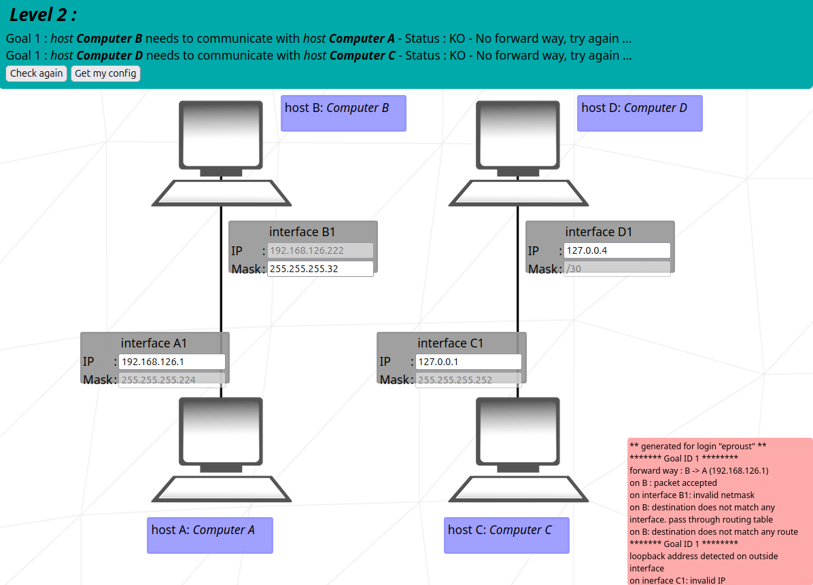

# NetPractice (42 Barcelona)

**This project involves solving networking problems to ensure a network operates correctly. It consists of multiple levels, each requiring the student to fix misconfigured networks by assigning correct IP addresses and subnet masks to routers, clients, servers, and their interfaces.**

- **Subject:** [English](subject/en.subject.pdf) / [French](subject/fr.subject.pdf)
- **Location:** 42 School Barcelona
- **Validation:** May 2025



## How to Use

To run the exercices, you need to files in `net_practice.1.5.tgz` available in the 42 intra (intra.42.fr).
Then, open in you internet browser with this command:

```bash
open net_practice/index.htm
```

## Concepts

### IP address

**An IP address has two parts:**
- **Network portion:** Defined by the subnet mask, this identifies the specific subnet the IP belongs to.
- **Host portion:** The remaining part, used to identify individual devices (hosts) within that subnet.

**Example: `192.168.1.10/24`**
- Subnet mask: `/24` (the first 24 bits are for the network, leaving 8 bits for host addresses)
- Network address: `192.168.1.0` (the first address in the subnet, used to identify the network itself)
- Host address: `192.168.1.10` where `10` is the host number (or ID) within the `192.168.1.0/24` subnet

### Subnet mask

- A subnet mask defines the size of a subnet in bits, denoted as `/N` (e.g., `/24`, `/27`), where `N` represents the number of bits allocated to the network portion (the most significant `N` bits).
	- `/24` (`255.255.255.0`) → 254 possible host addresses (`192.168.1.1` to `192.168.1.254`) + broadcast address: `192.168.1.255`
	- `/27` (`255.255.255.224`) → 30 possible host addresses (`192.168.1.1` to `192.168.1.30`) + broadcast address: `192.168.1.31`
- A valid mask has `0`s only in the host portion (least significant bits):
	- `255.255.255.222` is invalid mask: `222` is `11011110` in binary (there is a `0` surrounded by `1`s, so we cannot use the `/N` notation).
	- `255.255.255.240` is a valid mask: `240` is `11110000` in binary, allowing the use of the `/28` notation.

### Special types of IP addresses

- **Broadcast address**: special IP address used to send data to all devices within a subnet. It is the last address in the subnet range and is used for communication to every host within that subnet.
- **Loopback address**: allows a device to send data to itself for testing purposes.
	- Any IP address in the `127.0.0.0/8` range is reserved for loopback purposes, from `127.0.0.0` (network address) to `127.255.255.255` (broadcast address).
	- The most commonly used loopback address is `127.0.0.1`, often referred to as `localhost`. It represents the host with ID `1` on the loopback network.

## Conversion Example

### Get host IP from Mask

#### Example 1:

**Mask:** `/27` (`255.255.255.224`)\
Binary: `11111111.11111111.11111111.11100000`\
Useful part:					      `.11100000`			 (`.224`)

→ network address:			 `x.x.x.11000000`		(`x.x.x.192`)\
→ first usable host address:	 `x.x.x.11000001`		(`x.x.x.193`)\
→ last usable host address:	 `x.x.x.11011110`		(`x.x.x.222`)\
→ broadcast address:			 `x.x.x.11011111`		(`x.x.x.223`)\
→ **Usable host range:** `x.x.x.193` / `x.x.x.222`\
→ **Number of possible host IPs:** `2^5 - 2 = 30` *(5 host bits in the last octet)*

#### Example 2:

**Mask:** `/18` (`255.255.192.0`)\
Binary: `11111111.11111111.11000000.00000000`\
Useful part: `.11000000.00000000` (`.192.0`)

→ network address: `x.x.11000000.00000000` (`x.x.128.0`)\
→ first usable host address: `x.x.11000000.00000001` (`x.x.128.1`)\
→ last usable host address: `x.x.11111111.11111110` (`x.x.191.254`)\
→ broadcast address: `x.x.11111111.11111111` (`x.x.191.255`)\
→ **Usable host range:** `x.x.128.1` / `x.x.191.254`\
→ **Number of possible host IPs:** `2^14 - 2 = 16,382` *(14 host bits: 6 in the 3rd octet + 8 in the 4th)*

## Tips

### Allowed tools

- `bc`: a simple calculator that can be used to calculate binary decomposition.

### Quickly convert decimal to binary (Binary decomposition)

0000 0001 -> 2^0 -> 1\
0000 0010 -> 2^1 -> 2\
0000 0100 -> 2^2 -> 4\
0000 1000 -> 2^3 -> 8\
0001 0000 -> 2^4 -> 16\
0010 0000 -> 2^5 -> 32\
0100 0000 -> 2^6 -> 64\
1000 0000 -> 2^7 -> 128

Based on this, we can deduct that:\
232 = 128 + 

## References

- [Video: TCP/IP Model Explained](https://www.youtube.com/watch?v=OTwp3xtd4dg)
- [Gitbook](https://42-cursus.gitbook.io/guide/rank-04/netpractice/theory)