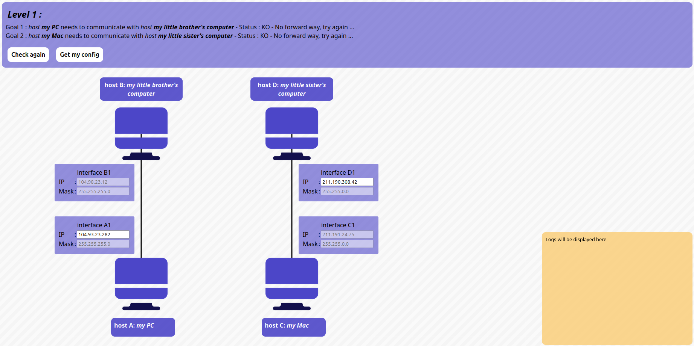
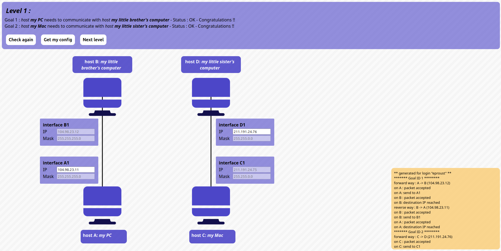

# Level 1

## Problem

### Goals
- *host A* needs to communicate with *host B*
- *host C* needs to communicate with *host D*

### Setup
- Host **A**
	- Interface **A1**: `?/255.255.255.0`
- Host **B**
	- Interface **B1**: `104.98.23.12/255.255.255.0`

- Host **C**
	- Interface **C1**: `211.191.24.75/255.255.0.0`
- Host **D**
	- Interface **D1**: `?/255.255.0.0`

## Solution:

- Host **A**
	- Interface **A1**: `104.98.23.11/255.255.255.0`
- Host **D**
	- Interface **D1**: `211.191.24.76/255.255.0.0`
