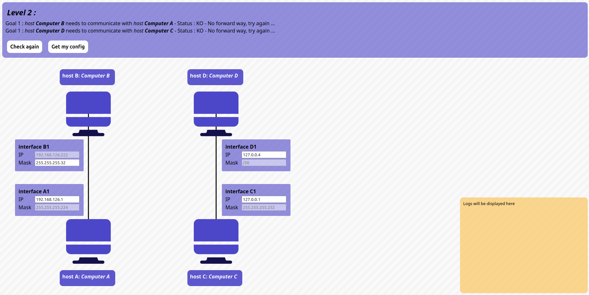
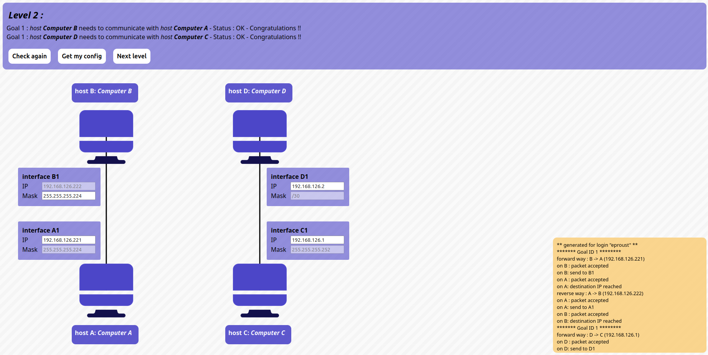

# Level 1

## Problem

### Goals
- *host A* needs to communicate with *host B*
- *host C* needs to communicate with *host D*

### Setup
- Host **A**
	- Interface **A1**: `?/255.255.255.224`
- Host **B**
	- Interface **B1**: `192.168.126.222/?`
- Host **C**
	- Interface **C1**: IP `?/255.255.255.252`
- Host **D**
	- Interface **D1**: IP `?/30`

## Solution:

- Host **A**
	- Interface **A1**: `192.168.126.221/255.255.255.224`
- Host **B**
	- Interface **B1**: `192.168.126.222/255.255.255.224`

- Host **C**
	- Interface **C1**: IP `192.168.126.1/255.255.255.252`
- Host **D**
	- Interface **D1**: IP `192.168.126.2/30`
