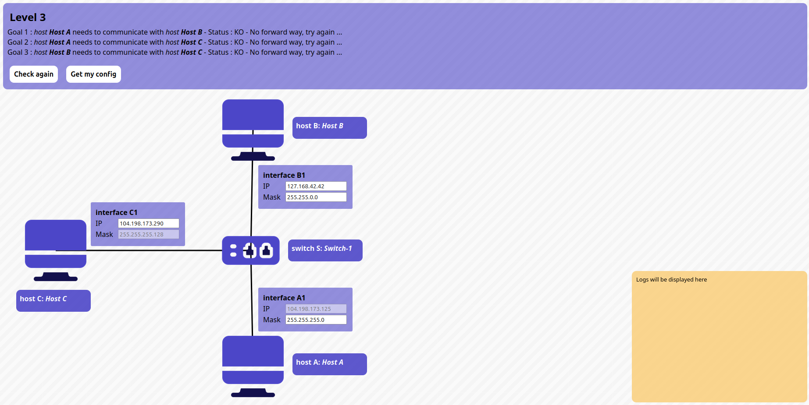
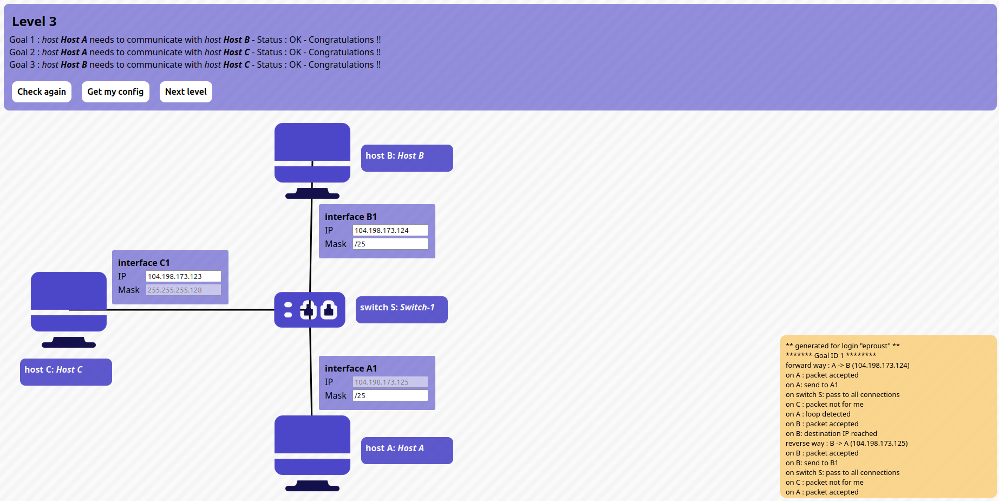

# Level 3

## Problem

### Goals
- **Host A** needs to communicate with **host B**
- **Host A** needs to communicate with **host C**
- **Host B** needs to communicate with **host C**

### Setup
- Host **A**
	- Interface **A1**: `104.198.173.125/?`
- Host **B**
	- Interface **B1**: `?/?`
- Host **C**
	- Interface **C1**: `?/255.255.255.128`

## Solution:

- Host **A**
	- Interface **A1**: `104.198.173.125/25`
- Host **B**
	- Interface **B1**: `104.198.173.124/255.255.255.128`
- Host **C**
	- Interface **C1**: `104.198.173.123/25`
