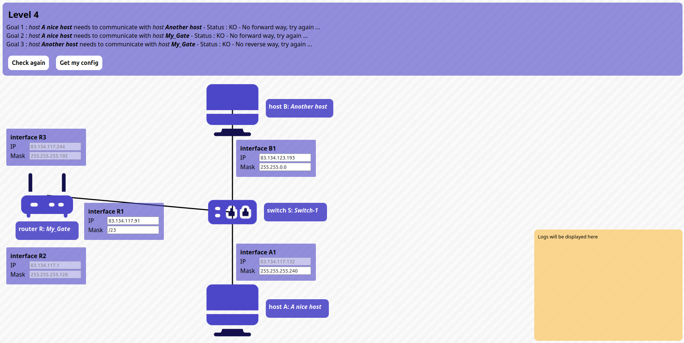
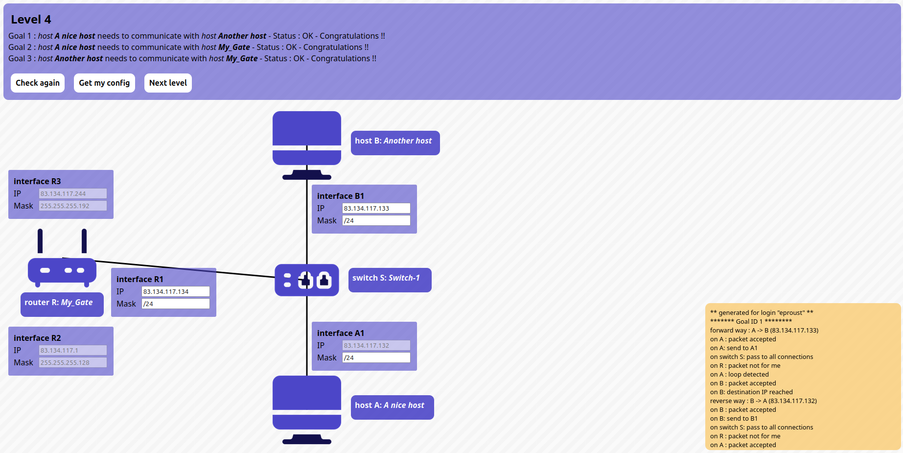

# Level 4

## Problem

### Goals
- **Host A** needs to communicate with **host B**
- **Host A** needs to communicate with **router R**
- **Host B** needs to communicate with **router R**

### Setup
- Host **A**
	- Interface **A1**: `83.134.117.132/?`
- Host **B**
	- Interface **B1**: `?/?`
- Router **R**
	- Interface **R1**: `?/?`
	- Interface **R2**: `83.134.117.1/255.255.255.128`
	- Interface **R3**: `83.134.117.244/255.255.255.192`

## Solution:

- Host **A**
	- Interface **A1**: `83.134.117.132/24`
- Host **B**
	- Interface **B1**: `83.134.117.133/24`
- Router **R**
	- Interface **R1**: IP `83.134.117.134/24`
