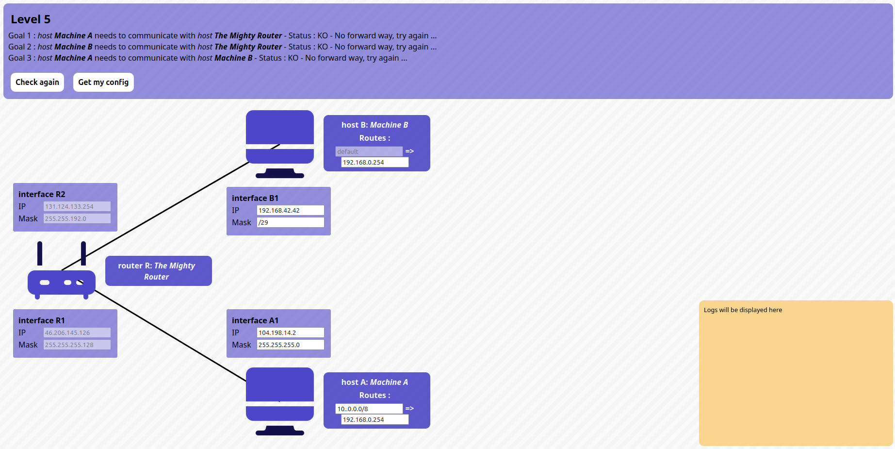
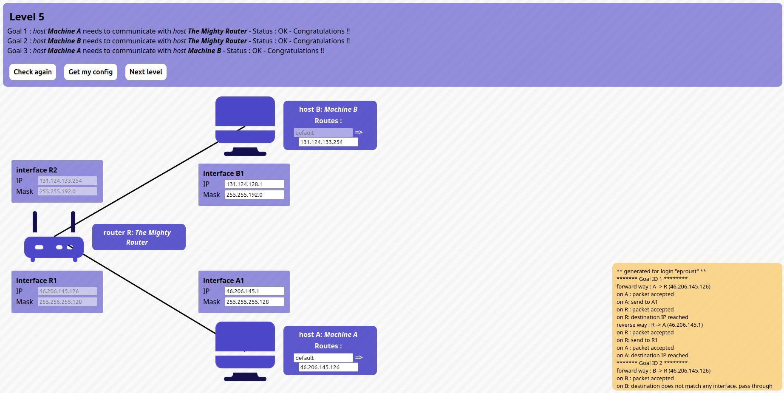

# Level 5

## Problem

### Goals
- **Host A** needs to communicate with **router R** (via interface **R1**)
- **Host B** needs to communicate with **router R** (via interface **R2**)
- **Host A** needs to communicate with **host B**

### Setup
- Host **A**
	- Routes: `? => ?`
	- Interface **A1**: `?/?`
- Host **B**
	- Routes: `default => ?`
	- Interface **B1**: `?/?`
- Router **R**
	- Interface **R1**: `46.206.145.126/255.255.255.128`
	- Interface **R2**: `131.124.133.254/255.255.192.0`

## Solution:

- Host **A**
	- Routes: `default => 46.206.145.126`
	- Interface **A1**: `46.206.145.1/255.255.255.128`
- Host **B**
	- Routes: `default => 131.124.133.254`
	- Interface **B1**: `131.124.128.1/255.255.192.0`
